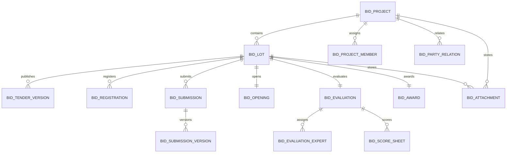

# 招投标管理系统数据模型设计

## 建模原则

- 以 `project` 和 `lot` 作为核心主线
- 将“当前态”和“历史快照”分开建模
- 将“主数据引用”和“业务快照”分开保存
- 一期优先逻辑清晰，不为未来多租户过度设计
- 所有业务主表默认带审计字段、删除标记、版本号

## 逻辑模型总览

## 核心实体

### 1. 招标项目 `bid_project`

#### 作用

- 表示一个完整采购 / 招标业务容器
- 承载项目级流程、组织归属、主责任人和状态

#### 建议字段

- `id`
- `project_code`
- `project_name`
- `project_type`
- `procurement_mode`
- `owner_org_id`
- `agent_org_id`
- `manager_employee_id`
- `status`
- `budget_amount`
- `publish_time`
- `award_time`
- `archive_time`
- `current_version`
- `remark`
- `deleted_flag`
- `create_time`
- `create_by`
- `update_time`
- `update_by`

### 2. 标段 `bid_lot`

#### 作用

- 作为投标、开标、评标、定标最小执行单元

#### 建议字段

- `id`
- `project_id`
- `lot_code`
- `lot_name`
- `lot_no`
- `lot_scope`
- `status`
- `budget_amount`
- `bid_start_time`
- `bid_end_time`
- `opening_time`
- `evaluation_mode`
- `award_mode`
- `deleted_flag`
- `version`
- `create_time`
- `update_time`

### 3. 项目成员 `bid_project_member`

#### 作用

- 描述内部人员在项目上的职责

#### 建议字段

- `id`
- `project_id`
- `employee_id`
- `role_code`
- `is_owner`
- `join_time`
- `leave_time`

### 4. 参与方关系 `bid_party_relation`

#### 作用

- 记录项目 / 标段与外部主体的关系
- 外部主体主数据优先引用现有 `enterprise`

#### 建议字段

- `id`
- `project_id`
- `lot_id`
- `party_type`
- `enterprise_id`
- `enterprise_name_snapshot`
- `credit_code_snapshot`
- `contact_name_snapshot`
- `contact_mobile_snapshot`
- `status`

## 招标与投标对象

### 5. 招标文件版本 `bid_tender_version`

#### 作用

- 存储招标文件、公告、澄清、更正的版本链

#### 建议字段

- `id`
- `project_id`
- `lot_id`
- `version_no`
- `version_type`
- `status`
- `parent_version_id`
- `effective_time`
- `publish_by`
- `publish_time`
- `summary`

### 6. 报名记录 `bid_registration`

#### 作用

- 记录供应商报名、受邀确认、资格初审

#### 建议字段

- `id`
- `project_id`
- `lot_id`
- `supplier_enterprise_id`
- `registration_type`
- `status`
- `qualified_result`
- `qualified_time`
- `qualified_by`
- `reject_reason`

### 7. 投标主记录 `bid_submission`

#### 作用

- 表示某供应商对某标段的一次投标主实体
- 当前态与最终结果挂在主记录上

#### 建议字段

- `id`
- `project_id`
- `lot_id`
- `supplier_enterprise_id`
- `registration_id`
- `status`
- `latest_version_no`
- `latest_submit_time`
- `receipt_no`
- `is_withdrawn`
- `withdraw_time`
- `withdraw_reason`
- `open_result`
- `evaluation_result`
- `award_result`

### 8. 投标版本 `bid_submission_version`

#### 作用

- 存储截止前多次提交形成的版本

#### 建议字段

- `id`
- `submission_id`
- `version_no`
- `submit_time`
- `submit_by`
- `price_amount`
- `contact_name`
- `contact_mobile`
- `file_manifest_json`
- `is_effective`

## 开评定标对象

### 9. 开标记录 `bid_opening`

#### 建议字段

- `id`
- `project_id`
- `lot_id`
- `status`
- `opening_time`
- `opening_place`
- `host_employee_id`
- `recorder_employee_id`
- `summary`
- `abnormal_flag`
- `abnormal_reason`

### 10. 开标明细 `bid_opening_item`

#### 作用

- 逐供应商记录唱标结果

#### 建议字段

- `id`
- `opening_id`
- `submission_id`
- `supplier_name_snapshot`
- `quoted_price`
- `document_check_result`
- `open_comment`

### 11. 评标主记录 `bid_evaluation`

#### 建议字段

- `id`
- `project_id`
- `lot_id`
- `status`
- `template_id`
- `start_time`
- `finalize_time`
- `final_summary`
- `rollback_reason`

### 12. 评标专家分配 `bid_evaluation_expert`

#### 建议字段

- `id`
- `evaluation_id`
- `expert_employee_id`
- `expert_name_snapshot`
- `expert_role`
- `status`
- `sign_in_time`

### 13. 评分表 `bid_score_sheet`

#### 作用

- 一行代表某专家对某投标的一份评分结果

#### 建议字段

- `id`
- `evaluation_id`
- `submission_id`
- `expert_employee_id`
- `total_score`
- `score_detail_json`
- `comment`
- `submit_time`
- `is_final`

### 14. 定标记录 `bid_award`

#### 建议字段

- `id`
- `project_id`
- `lot_id`
- `status`
- `recommended_supplier_id`
- `recommended_supplier_name_snapshot`
- `confirm_by`
- `confirm_time`
- `public_notice_time`
- `rollback_reason`

## 附件与留痕

### 15. 附件关联 `bid_attachment`

#### 作用

- 将现有文件模块和招投标业务对象关联

#### 建议字段

- `id`
- `business_type`
- `business_id`
- `project_id`
- `lot_id`
- `file_id`
- `file_category`
- `version_no`
- `sort_no`
- `is_main`

### 16. 流程历史 `bid_workflow_history`

#### 作用

- 存储状态迁移记录

#### 建议字段

- `id`
- `business_type`
- `business_id`
- `from_status`
- `to_status`
- `action_code`
- `operator_id`
- `operator_name`
- `operate_time`
- `comment`
- `snapshot_json`

## 快照策略

### 为什么需要快照

- 外部主体主数据可能变化
- 附件内容可能更新
- 评标 / 定标结果必须可追溯

### 建议快照对象

- 供应商名称、统一社会信用代码、联系人
- 招标文件版本摘要
- 投标提交清单
- 评标结论
- 定标结果

## 审计字段规范

### 所有业务主表建议统一字段

- `deleted_flag`
- `version`
- `create_time`
- `create_by`
- `update_time`
- `update_by`

### 不建议直接物理删除的对象

- 投标记录
- 开标记录
- 评标记录
- 定标记录
- 流程历史

## 索引建议

### 高优先级索引

- `bid_project`
  - `uk_project_code`
  - `idx_owner_org_status`
- `bid_lot`
  - `idx_project_id`
  - `idx_bid_end_time`
  - `idx_status`
- `bid_submission`
  - `uk_lot_supplier`
  - `idx_status`
  - `idx_latest_submit_time`
- `bid_registration`
  - `idx_lot_supplier_status`
- `bid_workflow_history`
  - `idx_business_type_id_time`

### 归档与查询友好索引

- `project_id + lot_id`
- `status + create_time`
- `owner_org_id + status`

## 与现有主数据的关系

- 内部人员
  - 引用现有员工 `employee`
- 内部组织
  - 引用现有部门 / 组织树
- 外部企业
  - 优先引用现有 `oa/enterprise`
- 文件
  - 引用现有 `file` 主表

## 一期不建议直接建的复杂模型

- 专家独立人才库完整体系
- 保证金完整资金台账
- 合同执行和付款结算模型
- 多租户隔离字段全量铺开

## 建库实施顺序

1. `bid_project`
2. `bid_lot`
3. `bid_project_member`
4. `bid_party_relation`
5. `bid_tender_version`
6. `bid_registration`
7. `bid_submission`
8. `bid_submission_version`
9. `bid_opening` / `bid_opening_item`
10. `bid_evaluation` / `bid_evaluation_expert` / `bid_score_sheet`
11. `bid_award`
12. `bid_attachment`
13. `bid_workflow_history`
