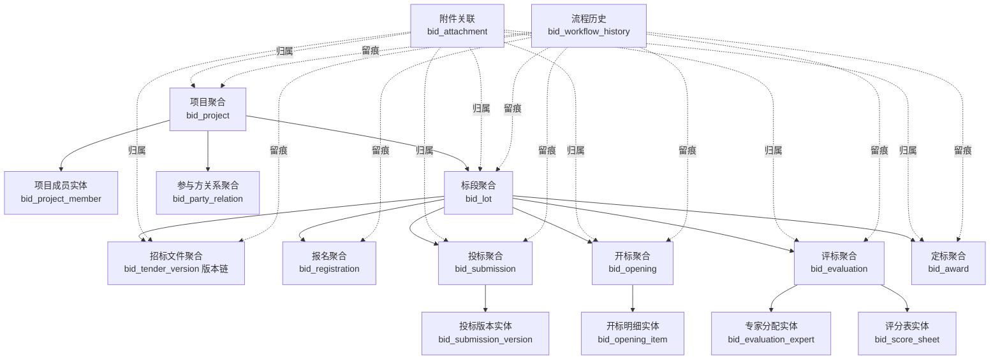

# 招投标管理系统领域模型设计

## 设计目标

- 在 `spec-draft.md`、`business-process.md`、`workflow-state-machine.md`、`data-model.md`、`permission-and-org-model.md`、`module-design.md` 已确认范围上，给出可直接指导实现的领域模型。
- 统一“聚合边界、状态边界、服务边界、引用边界”，避免后续把流程动作写成跨表脚本式更新。
- 直接映射一期后端模块：`bid-project`、`bid-party`、`bid-tender`、`bid-submission`、`bid-opening`、`bid-evaluation`、`bid-award`。
- 维持一期基线：`三方协同 + 供应商门户轻量版`，不把模型提前扩成公共电子交易平台或复杂规则引擎。

## 建模总原则

- 以 `project` 和 `lot` 为主业务骨架，但不把所有对象塞进一个大聚合。
- `lot` 是投标、开标、评标、定标的最小执行单元，因此在领域上独立成聚合，而不是 `project` 的内嵌子实体。
- “当前态”与“历史版本 / 历史快照”分离建模；可编辑对象不直接覆盖已生效结果。
- 聚合内维护本地不变量，跨聚合流程编排由应用服务或领域服务承担。
- 聚合之间只通过 `id` 和必要快照通信，不直接持有彼此的可变对象。
- 主数据优先复用现有 `employee / enterprise / file / dict`，业务对象只保存必要引用和不可回放场景所需快照。

## 聚合总览

## 核心聚合

### 1. 项目聚合 `Project`

#### 聚合根与实体

- 聚合根：`bid_project`
- 内部实体：`bid_project_member`

#### 职责边界

- 管理项目基础信息、组织归属、经办团队、项目级主状态。
- 管理项目成员、角色分工、责任人切换。
- 对外暴露项目级阶段摘要，但不直接承载招标文件、投标、评标明细。
- 负责项目是否允许进入 `PLANNED / PUBLISHED / ARCHIVED` 等项目级动作的总控校验。

#### 核心不变量

- `project_code` 全局唯一。
- 一个项目至少绑定一个有效 `owner_org_id`，存在代理协同时必须绑定 `agent_org_id`。
- 同一项目内同一员工的同一有效角色不重复分配。
- 项目进入 `PLANNED` 前至少存在一个有效标段。
- 项目进入 `PUBLISHED` 前，所有待发布标段都必须完成发布前校验。
- 项目进入 `ARCHIVED` 后默认只读，只允许归档查询或按回退规则发起退回。

#### 生命周期

- `DRAFT -> PLANNED -> PUBLISHED -> OPENING_IN_PROGRESS -> EVALUATING -> AWARDED -> ARCHIVED`
- 异常终态：`CANCELLED`
- 项目状态不是对子聚合状态的简单复制，而是应用服务根据标段摘要和关键事件进行推进。

#### 典型命令

- `CreateProject`
- `UpdateProject`
- `AssignProjectMember`
- `RemoveProjectMember`
- `SubmitProjectPlan`
- `PublishProject`
- `ArchiveProject`
- `CancelProject`

#### 典型事件

- `ProjectCreated`
- `ProjectUpdated`
- `ProjectMemberAssigned`
- `ProjectPlanSubmitted`
- `ProjectPublished`
- `ProjectArchived`
- `ProjectCancelled`

### 2. 标段聚合 `Lot`

#### 聚合根与实体

- 聚合根：`bid_lot`
- 一期不拆分独立子实体，标段下的招标、报名、投标、开评定标对象均为引用的其他聚合。

#### 职责边界

- 作为投标、开标、评标、定标的最小业务执行单元。
- 管理标段范围、预算、时间窗、评标方式、定标方式、标段状态。
- 对外提供“是否允许发布 / 截标 / 开标 / 评标 / 定标”的本地判定。
- 不直接持有投标文件版本、评分明细和定标结果对象。

#### 核心不变量

- `lot_code` 在同一 `project_id` 下唯一，`lot_no` 在同一项目下不重复。
- `bid_start_time <= bid_end_time <= opening_time`。
- 标段只能归属一个项目，发布后不允许跨项目迁移。
- 进入 `READY_FOR_PUBLISH` 前必须完成基础字段和时间窗校验。
- 进入 `BIDDING` 后不允许直接改写关键边界字段，只能通过回退、澄清、更正等动作影响后续流程。

#### 生命周期

- `DRAFT -> READY_FOR_PUBLISH -> BIDDING -> BID_CLOSED -> OPENED -> EVALUATING -> AWARDED -> ARCHIVED`
- 异常终态：`VOIDED`

#### 典型命令

- `CreateLot`
- `UpdateLot`
- `ReadyLotForPublish`
- `CloseLotBid`
- `VoidLot`

#### 典型事件

- `LotCreated`
- `LotUpdated`
- `LotReadyForPublish`
- `LotBidClosed`
- `LotVoided`

### 3. 参与方关系聚合 `PartyRelation`

#### 聚合根与实体

- 聚合根：`bid_party_relation`
- 一期按轻量关系聚合实现，不再继续拆更细的参与方子对象。

#### 职责边界

- 记录项目或标段与外部企业主体的关系，如受邀供应商、候选供应商、协同单位等。
- 承载外部企业主数据的业务快照，用于后续列表、导出、留痕、结果展示。
- 作为供应商参与资格、门户可见范围、项目关系查询的辅助索引对象。
- 不承担报名审核、投标提交、评标打分等流程职责。

#### 核心不变量

- `project_id` 必填，`lot_id` 可选；若 `lot_id` 有值，则必须属于该 `project_id`。
- 同一范围内 `party_type + enterprise_id` 只允许一条有效关系。
- 快照字段只在创建关系、显式刷新快照、或明确切换绑定对象时更新，不随主数据被动覆盖历史业务事实。

#### 生命周期

- 以“有效 / 失效”为主，不单独引入复杂状态机。

#### 典型命令

- `BindPartyRelation`
- `RefreshPartySnapshot`
- `DisablePartyRelation`

#### 典型事件

- `PartyRelationBound`
- `PartySnapshotRefreshed`
- `PartyRelationDisabled`

### 4. 招标文件聚合 `Tender`

#### 聚合根与实体

- 逻辑聚合根：`Tender`
- 一期落库实现：按 `lot_id` 组织的 `bid_tender_version` 版本链，不单独新增 `bid_tender` 主表。
- 内部实体：`TenderVersion`

#### 职责边界

- 管理招标方案、招标文件、公告、澄清、更正的版本链。
- 管理“当前有效版本”和“历史版本”之间的替换关系。
- 发布后向供应商侧提供可见版本与附件集合。
- 不负责供应商报名和投标文件收取。

#### 核心不变量

- 同一标段同一时刻只允许一个 `ACTIVE` 主版本。
- 已 `ACTIVE` 的版本不可直接覆盖内容，只能生成新版本并将旧版本置为 `SUPERSEDED`。
- 澄清 / 更正版本必须关联 `parent_version_id`。
- 发布动作必须冻结当次附件集合、版本摘要和发布时间。

#### 生命周期

- `DRAFT -> REVIEWING -> ACTIVE -> SUPERSEDED`
- 异常终态：`WITHDRAWN`

#### 典型命令

- `DraftTenderVersion`
- `UpdateTenderDraft`
- `PublishTenderVersion`
- `PublishTenderClarification`
- `WithdrawTenderVersion`

#### 典型事件

- `TenderDraftCreated`
- `TenderVersionPublished`
- `TenderClarificationPublished`
- `TenderVersionWithdrawn`

### 5. 报名聚合 `Registration`

#### 聚合根与实体

- 聚合根：`bid_registration`
- 一期不再拆资格规则子聚合，资格审核按聚合内状态和审核字段处理。

#### 职责边界

- 处理供应商报名、受邀确认、资格初审。
- 维护供应商能否进入正式投标阶段的本地结论。
- 为投标聚合提供“可否创建 / 可否提交”的前置准入判定。
- 不持有投标文件版本，不承担报价和回执编号管理。

#### 核心不变量

- 同一 `lot_id + supplier_enterprise_id` 只允许一个有效报名记录。
- 报名必须满足标段可报名或已受邀前提。
- 审核驳回必须填写原因。
- 只有资格通过的报名记录才允许关联 `bid_submission`。

#### 生命周期

- `INVITED -> REGISTERED -> QUALIFYING -> QUALIFIED`
- 异常终态：`REJECTED`

#### 典型命令

- `InviteSupplier`
- `RegisterInterest`
- `SubmitQualification`
- `ApproveQualification`
- `RejectQualification`

#### 典型事件

- `SupplierInvited`
- `RegistrationSubmitted`
- `QualificationApproved`
- `QualificationRejected`

### 6. 投标聚合 `Submission`

#### 聚合根与实体

- 聚合根：`bid_submission`
- 内部实体：`bid_submission_version`

#### 职责边界

- 管理一个供应商在一个标段上的正式投标行为。
- 管理投标版本、当前有效版本、回执编号、撤回记录、当前处理结果。
- 负责截止前多次重提、截止后冻结、开标后只读。
- 不负责唱标结果、专家评分和定标审批。

#### 核心不变量

- 同一 `lot_id + supplier_enterprise_id` 只允许一个 `bid_submission` 主记录。
- 投标主记录必须关联有效 `registration_id`。
- `latest_version_no` 单调递增，任一时刻只允许一个有效提交版本。
- 超过 `bid_end_time` 后禁止 `submitBid` 和 `withdrawBid`。
- 开标完成后投标附件和报价信息只读，不允许替换。

#### 生命周期

- 起始前提：关联报名记录已 `QUALIFIED`
- `SUBMITTED -> OPENED -> EVALUATED -> AWARDED / LOST`
- 异常终态：`WITHDRAWN`

#### 典型命令

- `CreateSubmission`
- `SubmitBid`
- `ResubmitBid`
- `WithdrawBid`
- `MarkSubmissionOpened`
- `MarkSubmissionEvaluated`
- `MarkSubmissionAwarded`
- `MarkSubmissionLost`

#### 典型事件

- `SubmissionCreated`
- `BidSubmitted`
- `BidResubmitted`
- `BidWithdrawn`
- `SubmissionOpened`
- `SubmissionEvaluated`
- `SubmissionAwarded`
- `SubmissionLost`

### 7. 开标聚合 `Opening`

#### 聚合根与实体

- 聚合根：`bid_opening`
- 内部实体：`bid_opening_item`

#### 职责边界

- 管理一个标段的一次开标会话及其唱标明细。
- 负责已截止投标记录的开标确认、异常留痕、主持人 / 记录人信息。
- 输出唱标结果和开标摘要。
- 不负责评分汇总和中标结论。

#### 核心不变量

- 一期一个标段只维护一个当前开标聚合；回退场景通过状态回退和历史留痕处理，不新开多轮模型。
- 只有 `lot.status = BID_CLOSED` 才允许启动开标。
- 开标明细只能引用截标时有效的投标记录。
- `ABNORMAL_CLOSED` 必须记录异常原因、处置意见和责任人。
- `COMPLETED` 后不允许再修改唱标结果，除非先按既定规则退回。

#### 生命周期

- `PENDING -> IN_PROGRESS -> COMPLETED`
- 异常终态：`ABNORMAL_CLOSED`

#### 典型命令

- `CreateOpening`
- `StartOpening`
- `RecordOpeningItem`
- `CompleteOpening`
- `AbnormalCloseOpening`

#### 典型事件

- `OpeningCreated`
- `OpeningStarted`
- `OpeningItemRecorded`
- `OpeningCompleted`
- `OpeningAbnormallyClosed`

### 8. 评标聚合 `Evaluation`

#### 聚合根与实体

- 聚合根：`bid_evaluation`
- 内部实体：
  - `bid_evaluation_expert`
  - `bid_score_sheet`

#### 职责边界

- 管理专家分配、评分录入、澄清等待、汇总结果和评标结论快照。
- 维护评标过程中“谁能看什么、谁能改什么”的局部规则。
- 输出可供定标聚合消费的最终评标结论。
- 不负责中标审批动作本身。

#### 核心不变量

- 只有 `lot.status = OPENED` 才允许启动评标。
- 同一评标记录内同一 `expert_employee_id` 只允许一个有效分配。
- 单个专家对单个投标对象只允许一份最终评分结果；草稿可更新，但 `is_final = true` 后不得被普通编辑覆盖。
- 进入 `SUMMARIZING` 后不再允许单条评分随意修改。
- `FINALIZED` 必须生成汇总结论快照，并保留所用模板版本或模板标识。

#### 生命周期

- `PENDING -> SCORING -> WAITING_CLARIFICATION -> SUMMARIZING -> FINALIZED`
- 异常 / 回退态：`ROLLED_BACK`

#### 典型命令

- `CreateEvaluation`
- `AssignExpert`
- `StartEvaluation`
- `SubmitScoreSheet`
- `RequestClarification`
- `ResumeEvaluation`
- `FinalizeEvaluation`
- `RollbackEvaluation`

#### 典型事件

- `EvaluationCreated`
- `ExpertAssigned`
- `EvaluationStarted`
- `ScoreSheetSubmitted`
- `ClarificationRequested`
- `EvaluationFinalized`
- `EvaluationRolledBack`

### 9. 定标聚合 `Award`

#### 聚合根与实体

- 聚合根：`bid_award`
- 一期不拆复杂审批子聚合，审批意见作为聚合字段和流程留痕处理。

#### 职责边界

- 管理定标审查、确认、中标结果、公示时间和退回。
- 固化中标供应商、结论文本和结果快照。
- 驱动投标结果和项目 / 标段结果视图更新。
- 不回写评标评分细节。

#### 核心不变量

- 一个标段只允许一个当前有效定标聚合。
- 只有 `evaluation.status = FINALIZED` 才允许进入定标审查或确认。
- `recommended_supplier_id` 必须来自该标段已参与评标的投标供应商集合。
- `CONFIRMED` 后结果默认不可编辑；如需修正，只能走 `rollback` 或 `cancel`。
- 回退、取消必须保留原因。

#### 生命周期

- `PENDING -> REVIEWING -> CONFIRMED`
- 异常 / 回退态：`ROLLED_BACK`、`CANCELLED`

#### 典型命令

- `CreateAward`
- `SubmitAwardReview`
- `ConfirmAward`
- `RollbackAward`
- `CancelAward`

#### 典型事件

- `AwardCreated`
- `AwardReviewSubmitted`
- `AwardConfirmed`
- `AwardRolledBack`
- `AwardCancelled`

## 支撑对象而非独立流程聚合

### 附件关联 `bid_attachment`

- 角色：共享支撑对象，不单独承载业务状态机。
- 归属方式：`business_type + business_id` 指向所属聚合根或其版本实体。
- 职责：
  - 绑定 `file_id`
  - 标识 `file_category`
  - 标识版本号、排序、主附件标记
- 规则：
  - 附件增删改必须跟随所属聚合命令执行。
  - 已发布招标版本、已提交投标版本、已完成开评定标记录的附件集合必须冻结。

### 流程历史 `bid_workflow_history`

- 角色：追加式留痕对象，不作为业务根对象对外暴露编辑接口。
- 职责：
  - 记录状态迁移
  - 记录动作发起人、来源端、备注
  - 存储必要 `snapshot_json`
- 规则：
  - 任何状态动作都必须追加历史，不允许改写历史记录。

## 聚合间引用规则

### 基本规则

- 跨聚合只保存外键或稳定业务键，不保存对方完整可变对象。
- 聚合加载遵循“命令路径只装载当前聚合”原则，跨聚合展示通过查询模型或联表读模型完成。
- 一个命令可以在应用服务层协调多个聚合，但每个聚合自身的不变量必须在本聚合内校验。

### 具体引用约束

- `Project -> Lot`
  - `Lot` 仅保存 `project_id`
  - `Project` 不在事务内持有全部标段对象，只通过摘要判断是否允许项目级动作
- `Lot -> Tender / Registration / Submission / Opening / Evaluation / Award`
  - 这些对象都以 `lot_id` 为主引用，不反向内嵌到 `bid_lot`
- `Registration -> Submission`
  - `Submission` 只保存 `registration_id`，不复制资格审核过程明细
- `OpeningItem -> Submission`
  - 保存 `submission_id`，同时保留供应商名称和唱标结果快照
- `ScoreSheet -> Submission`
  - 保存 `submission_id`，评分明细只引用投标对象，不复制投标文件实体
- `Award -> Evaluation / Submission`
  - `Award` 只消费评标结论和推荐供应商标识，不持有评分表集合
- `Attachment -> Aggregate`
  - 一律通过 `business_type + business_id` 归属，不允许直接把 `file_key`、`file_url` 等文件存储细节散落到业务主表

### 禁止事项

- 禁止在 `Project` 聚合中直接维护投标、开标、评标、定标明细集合。
- 禁止通过普通 `update` 接口跨聚合修改状态。
- 禁止依赖外部主数据实时查询结果去覆盖已生效业务事实。

## 命令 / 事件实现视角

### 命令侧

- `controller`
  - 接收 `*CreateForm / *UpdateForm / *ActionForm`
  - 做权限码、数据范围、基础参数校验
- `service`
  - 作为应用服务执行一个完整用例
  - 读取必要聚合
  - 调用聚合方法校验并变更状态
  - 持久化主表、子实体、附件、流程历史
- `manager`
  - 承担持久化编排、批量明细落库、与现有基础组件的整合

### 事件侧

- 一期不引入独立 MQ 事件总线。
- 领域事件应先作为代码里的明确概念存在，并至少落到：
  - `bid_workflow_history`
  - 操作日志 / 数据追踪日志
- 如有跨聚合同步需求，优先使用单体内 `after-commit` 应用事件或应用服务顺序编排，不先引入分布式最终一致性复杂度。

### 典型编排链路

- `PublishTenderVersion`
  - 产出 `TenderVersionPublished`
  - 驱动 `Lot` 进入 `BIDDING`
  - 应用服务再重算 `Project` 是否进入 `PUBLISHED`
- `CloseLotBid`
  - 产出 `LotBidClosed`
  - 允许创建或启动 `Opening`
- `CompleteOpening`
  - 产出 `OpeningCompleted`
  - 驱动相关 `Submission` 标记为 `OPENED`
  - 驱动 `Lot` 进入 `OPENED`
- `FinalizeEvaluation`
  - 产出 `EvaluationFinalized`
  - 允许 `Award` 进入审查 / 确认
- `ConfirmAward`
  - 产出 `AwardConfirmed`
  - 驱动相关 `Submission` 标记 `AWARDED / LOST`
  - 驱动 `Lot`、`Project` 进入结果态

## 服务职责与代码结构映射

### `bid-project`

- 聚合：
  - `Project`
  - `Lot`
- 应用服务职责：
  - 项目建档
  - 项目成员管理
  - 标段建档与冻结
  - 项目级阶段推进

### `bid-party`

- 聚合：
  - `PartyRelation`
- 应用服务职责：
  - 外部企业关系绑定
  - 快照刷新
  - 供应商可见范围辅助查询

### `bid-tender`

- 聚合：
  - `Tender`
- 应用服务职责：
  - 招标文件版本维护
  - 公告 / 澄清 / 更正发布
  - 当前有效版本切换

### `bid-submission`

- 聚合：
  - `Registration`
  - `Submission`
- 应用服务职责：
  - 报名 / 受邀
  - 资格初审
  - 投标提交 / 重提 / 撤回
  - 回执与版本冻结

### `bid-opening`

- 聚合：
  - `Opening`
- 应用服务职责：
  - 开标启动
  - 唱标记录
  - 异常留痕

### `bid-evaluation`

- 聚合：
  - `Evaluation`
- 应用服务职责：
  - 专家分配
  - 评分录入
  - 澄清等待
  - 评标汇总与结论固化

### `bid-award`

- 聚合：
  - `Award`
- 应用服务职责：
  - 定标审查
  - 定标确认
  - 结果确认与回退

## 与现有主数据的关系

### 员工 `employee`

- 现有实现：
  - 实体：`t_employee` / `EmployeeEntity`
- 在招投标域中的使用方式：
  - 项目负责人、项目成员、开标主持人、记录人、评标专家、定标确认人均只保存 `employeeId`
- 规则：
  - 命令校验时查询员工是否存在、是否禁用
  - 业务主表默认不冗余完整员工档案
  - 审计和流程历史中可附带 `operatorName` 作为操作快照

### 企业 `enterprise`

- 现有实现：
  - 实体：`t_oa_enterprise` / `EnterpriseEntity`
- 在招投标域中的使用方式：
  - 供应商、协同单位等外部主体只保存 `enterpriseId`
  - 在 `PartyRelation`、`OpeningItem`、`Award` 等不可回放场景保存名称、统一社会信用代码、联系人等快照
- 规则：
  - 主数据变更不能回写历史业务事实
  - 结果展示、归档、导出优先使用业务快照而不是实时企业表

### 文件 `file`

- 现有实现：
  - 实体：`t_file` / `FileEntity`
- 在招投标域中的使用方式：
  - 业务表只保存 `fileId` 或在 `file_manifest_json` 中保存文件集合摘要
  - 实际文件元数据、下载地址、存储介质能力仍由现有文件模块提供
- 规则：
  - 通过 `bid_attachment` 统一挂载，不在业务主表散存 `fileKey`、`fileUrl`
  - 生效版本必须冻结附件集合

### 字典 `dict`

- 现有实现：
  - 实体：`t_dict` / `t_dict_data`
  - 服务：`DictService`
- 在招投标域中的使用方式：
  - 采购方式、评标方式、文件分类、关系类型等业务枚举优先使用 `dictCode + dataValue`
  - 核心状态机枚举仍建议固化在代码枚举中，不交给运营字典随意修改
- 规则：
  - 列表展示时实时取字典标签
  - 导出、归档、流程快照中的不可变文本可渲染为当时标签

## 快照、版本与独立演进策略

### 必须保存快照的对象

- `bid_party_relation`
  - 保存企业名称、统一社会信用代码、联系人、联系电话快照
- `bid_tender_version`
  - 保存版本摘要、父版本关系、发布时间、当次附件集合
- `bid_submission_version`
  - 保存报价、联系人、附件清单、提交时间、有效标记
- `bid_opening_item`
  - 保存供应商名称快照、唱标报价、资料核验结果
- `bid_evaluation`
  - 保存最终汇总结论快照
- `bid_score_sheet`
  - 保存模板展开后的评分明细快照 `score_detail_json`
- `bid_award`
  - 保存中标供应商名称快照、确认时间、公示时间、回退原因
- `bid_workflow_history`
  - 保存动作上下文 `snapshot_json`

### 只保存引用、不默认做主表快照的对象

- 内部员工档案
- 组织树 / 部门树
- 文件存储元信息
- 字典标签文本

这些对象如需进入不可变结果材料，应在导出、归档、公告生成时渲染进结果文件或快照字段，而不是把整套主数据复制进业务主表。

### 允许独立演进的对象

- `TenderVersion`
  - 可增加版本类型、附加元数据，不影响 `Project / Lot` 聚合边界
- `SubmissionVersion.file_manifest_json`
  - 可在保持“有效版本唯一”规则不变的前提下独立扩展文件清单结构
- `ScoreSheet.score_detail_json`
  - 可随模板版本演进评分项结构
- `PartyRelation`
  - 可扩展更多快照字段或关系类型，而不改变报名 / 投标主流程
- `Attachment.file_category`
  - 可通过字典扩展分类，不改变业务聚合结构

### 不允许随意独立演进的对象

- `Project / Lot / Submission / Evaluation / Award` 的核心状态枚举
- 跨聚合动作接口命名
- `lot_id` 作为最小执行边界这一建模前提

这些属于跨模块契约，变更时应同步更新状态机文档、接口契约文档和实现代码。

## 一期明确不建的复杂域模型

- 不建独立电子交易大厅聚合，不把轻量门户扩成公共交易平台。
- 不建 CA 签章、在线解密、密封投标文件加解密域模型。
- 不建隔离式电子评标环境及其终端、会话、介质控制模型。
- 不建复杂专家库、随机抽取、回避、合议、轮换等专家治理聚合。
- 不建保证金 / 保函 / 资金台账聚合。
- 不建合同、履约、结算、付款等后置履约域模型。
- 不建多租户隔离域模型；一期沿用现有组织和数据权限能力。
- 不把评分模板做成 DSL / 规则引擎聚合；一期按固定模板 + 明细快照实现。
- 不引入 BPM 引擎审批流；一期以业务状态机和动作接口推进。

## 实施落地约束

- 先冻结 `Project / Lot / Submission / Evaluation / Award` 的状态枚举和动作名，再落控制器与前端按钮。
- 新增查询接口可以跨聚合拼装读模型，但写路径必须回到所属聚合。
- 任一“发布、提交、完成、确认、归档、回退”动作都必须同步写入 `bid_workflow_history`。
- 任何需要保留历史事实的动作，都不得只更新当前主表而不形成版本或快照。
