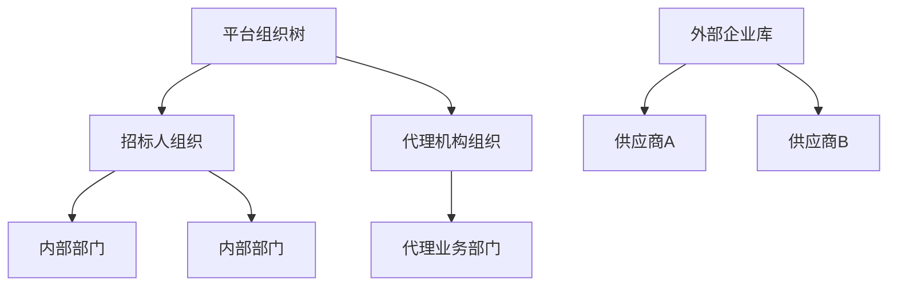

# 招投标管理系统组织与权限模型设计

## 设计目标

- 在现有组织、角色、数据权限底座上落地招投标业务隔离
- 明确三类主体的访问边界
- 让“功能权限”和“数据权限”分离建模
- 控制一期复杂度，但为后续集团化或更强门户能力预留扩展点

## 一期组织模型

### 基线选择

- 采用“单平台、多组织协同”模型
- 不在一期引入独立多租户体系
- 一个项目至少关联两个组织维度：
  - `ownerOrg`
    - 招标人 / 采购人归属组织
  - `agentOrg`
    - 招标代理机构归属组织
- 供应商作为外部企业主体参与，不视为内部组织树节点

## 组织层级

## 对现有系统能力的复用

- 内部用户
  - 复用现有员工、部门、岗位、角色
- 数据范围
  - 复用现有 `datascope`
- 门户用户
  - 一期建议单独建设供应商账号域或外部用户映射表
  - 不与内部员工账号混用

## 角色模型

### 内部角色

- `BID_OWNER`
  - 招标人项目负责人
- `BID_OWNER_APPROVER`
  - 招标人审批人
- `BID_AGENT_OPERATOR`
  - 招标代理经办
- `BID_AGENT_MANAGER`
  - 招标代理负责人
- `BID_EVALUATION_EXPERT`
  - 内部受控评标专家
- `BID_ARCHIVIST`
  - 归档管理员
- `BID_AUDITOR`
  - 审计 / 监督查看角色

### 门户角色

- `SUPPLIER_ADMIN`
  - 供应商管理员
- `SUPPLIER_OPERATOR`
  - 供应商经办人
- `SUPPLIER_VIEWER`
  - 供应商只读人员

## 角色与职责边界

### 招标人 / 采购人

- 创建项目
- 审核关键节点
- 确认定标结果
- 查看全过程材料

### 招标代理机构

- 维护招标文件
- 发布公告
- 组织报名、开标、评标
- 协同整理过程文档

### 供应商

- 查看可参与项目
- 报名 / 提交响应资料
- 提交投标文件
- 响应澄清
- 查看结果

## 功能权限模型

### 权限码原则

- 按资源 + 动作命名
- `apiPerms` 与 `webPerms` 对齐
- 关键流程动作必须是单独权限码

## 首批权限码建议

### project

- `bid:project:query`
- `bid:project:create`
- `bid:project:update`
- `bid:project:submit-plan`
- `bid:project:publish`
- `bid:project:archive`
- `bid:project:cancel`

### lot

- `bid:lot:query`
- `bid:lot:create`
- `bid:lot:update`
- `bid:lot:close-bid`
- `bid:lot:void`

### tender

- `bid:tender:query`
- `bid:tender:create`
- `bid:tender:publish`
- `bid:tender:clarify`

### submission

- `bid:submission:query`
- `bid:submission:approve-qualification`
- `bid:submission:reject-qualification`
- `bid:submission:download`
- `bid:submission:submit`
- `bid:submission:withdraw`

### opening

- `bid:opening:query`
- `bid:opening:start`
- `bid:opening:complete`
- `bid:opening:abnormal-close`

### evaluation

- `bid:evaluation:query`
- `bid:evaluation:start`
- `bid:evaluation:score`
- `bid:evaluation:finalize`
- `bid:evaluation:rollback`

### award

- `bid:award:query`
- `bid:award:review`
- `bid:award:confirm`
- `bid:award:rollback`

## 数据权限模型

### 项目级数据边界

### 招标人

- 可访问：
  - `owner_org_id` 在本人数据范围内的项目
- 默认不可访问：
  - 无关代理项目
  - 未授权监督项目

### 招标代理机构

- 可访问：
  - `agent_org_id` 在本人数据范围内的项目
- 默认不可访问：
  - 未受托项目

### 供应商

- 可访问：
  - 对其公开可报名的项目摘要
  - 已报名、已投标、已中标或已落标的本企业记录
- 默认不可访问：
  - 其他供应商投标信息
  - 非本企业澄清、报价、评标细节

## 行级隔离建议

- 项目表：按 `owner_org_id` / `agent_org_id` 控制
- 标段表：继承项目权限
- 投标表：再叠加 `supplier_enterprise_id`
- 评标表：再叠加专家分配关系

## 评标隔离

### 一期目标

- 虽不建设强隔离评标环境，但必须做到业务隔离

### 规则

- 评标专家只能访问被分配的 `evaluation`
- 专家在评标期内只能看到：
  - 评分模板
  - 其本人待评分对象
  - 已授权查看的投标材料
- 专家默认不能看到：
  - 其他专家评分明细
  - 未分配标段
  - 定标审批意见
- 评标汇总查看权限仅开放给：
  - 招标人项目负责人
  - 代理机构指定负责人
  - 审批角色

## 门户认证与企业边界

### 账号模型建议

- 企业主体 `supplier_enterprise`
- 企业管理员账号
- 企业经办账号
- 企业成员与项目授权关系

### 一期建议

- 一个供应商企业至少一个管理员
- 管理员可邀请企业经办人
- 门户用户只能加入一个供应商企业
- 同一企业下多个经办人可协作，但不能看到无授权项目

## 角色矩阵

| 动作 | 招标人负责人 | 招标人审批人 | 代理经办 | 代理负责人 | 评标专家 | 供应商管理员 | 供应商经办 |
|---|---|---|---|---|---|---|---|
| 创建项目 | Y | N | N | N | N | N | N |
| 编辑项目 | Y | N | Y | Y | N | N | N |
| 发布招标文件 | Y | N | Y | Y | N | N | N |
| 审核资格 | Y | N | Y | Y | N | N | N |
| 提交投标文件 | N | N | N | N | N | Y | Y |
| 启动开标 | Y | N | Y | Y | N | N | N |
| 专家评分 | N | N | N | N | Y | N | N |
| 确认定标 | Y | Y | N | N | N | N | N |
| 查看结果 | Y | Y | Y | Y | N | Y | Y |
| 归档 | Y | N | Y | Y | N | N | N |

## 最小权限原则

- 默认无权限
- 先授资源读权限，再授动作权限
- 流程动作权限必须比普通编辑权限更细
- 门户默认只暴露必要最小页面和字段

## 审计与监督

- 关键动作必须记录操作者、组织、来源端
- 建议增加 `operator_side`
  - `OWNER`
  - `AGENT`
  - `SUPPLIER`
  - `EXPERT`
  - `SYSTEM`
- 审计角色只读，不参与业务动作

## 后续扩展点

- 多公司 / 集团多级组织
- 多租户模型
- 更复杂的门户准入
- 专家回避和随机抽取
- 更强评标隔离与审批链
