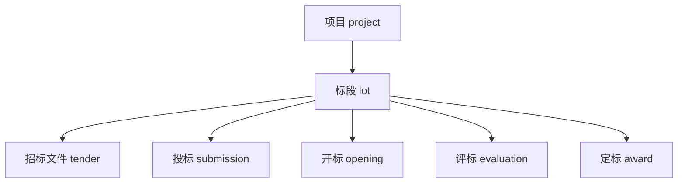
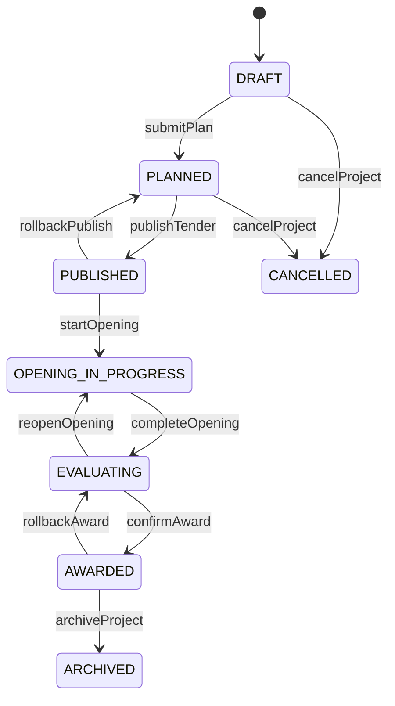

# 招投标管理系统状态机设计

## 设计目标

- 用业务状态机承载一期固定流程
- 保证“流程动作”和“普通编辑”分离
- 让前端基于 `allowedActions` 渲染交互，而不是自行推断
- 为后续扩展 BPM 或更复杂审批预留空间，但当前不依赖 BPM

## 状态机总原则

- 主流程围绕 `project` 和 `lot` 展开，其他对象状态受其约束
- 每次状态迁移都必须记录：
  - `fromStatus`
  - `toStatus`
  - `action`
  - `operatorId`
  - `operatorName`
  - `operateTime`
  - `comment`
- 所有动作接口默认要求版本号 `version`，使用乐观锁避免并发覆盖
- 允许退回，但不允许直接覆盖历史状态记录
- 终态对象默认只读，任何更改都通过“退回”或“更正”动作进入新状态

## 主对象关系

## 1. 项目状态机

### 状态枚举

- `DRAFT`
- `PLANNED`
- `PUBLISHED`
- `OPENING_IN_PROGRESS`
- `EVALUATING`
- `AWARDED`
- `ARCHIVED`
- `CANCELLED`

### 流转图

### 进入条件

- `PLANNED`
  - 至少存在一个有效标段
- `PUBLISHED`
  - 所有待发布标段已冻结基础信息
  - 招标文件主版本已生成
- `OPENING_IN_PROGRESS`
  - 至少一个标段达到开标时间窗
- `EVALUATING`
  - 所有纳入本轮的标段开标完成
- `AWARDED`
  - 所有参与定标的标段已形成评标结论
- `ARCHIVED`
  - 所有结果文档和附件已归档

### 关键动作

- `submitPlan`
- `publishTender`
- `rollbackPublish`
- `startOpening`
- `completeOpening`
- `confirmAward`
- `rollbackAward`
- `archiveProject`
- `cancelProject`

## 2. 标段状态机

### 状态枚举

- `DRAFT`
- `READY_FOR_PUBLISH`
- `BIDDING`
- `BID_CLOSED`
- `OPENED`
- `EVALUATING`
- `AWARDED`
- `ARCHIVED`
- `VOIDED`

### 状态说明

- `DRAFT`
  - 标段草稿，可维护范围、预算、时间窗
- `READY_FOR_PUBLISH`
  - 已完成发布前校验
- `BIDDING`
  - 已对供应商开放报名 / 提交
- `BID_CLOSED`
  - 到达截止时间，停止提交
- `OPENED`
  - 已完成开标
- `EVALUATING`
  - 已进入评标
- `AWARDED`
  - 已确认定标
- `ARCHIVED`
  - 已归档
- `VOIDED`
  - 废止或流标

### 关键流转规则

- `READY_FOR_PUBLISH -> BIDDING`
  - 触发：公告 / 文件发布
- `BIDDING -> BID_CLOSED`
  - 触发：到达截止时间或人工关闭
- `BID_CLOSED -> OPENED`
  - 触发：完成开标记录
- `OPENED -> EVALUATING`
  - 触发：评标启动
- `EVALUATING -> AWARDED`
  - 触发：定标确认
- `AWARDED -> ARCHIVED`
  - 触发：归档完成
- 任意前置状态 -> `VOIDED`
  - 触发：流标 / 废止

## 3. 招标文件状态机

### 状态枚举

- `DRAFT`
- `REVIEWING`
- `ACTIVE`
- `SUPERSEDED`
- `WITHDRAWN`

### 规则

- 同一标段在同一时刻只允许一个 `ACTIVE` 主版本
- 新澄清 / 更正发布后：
  - 原主版本保持可追溯
  - 当前有效版本切换为新版本
- 已进入 `ACTIVE` 的版本不可直接覆盖文件内容，只能产生新版本

## 4. 投标状态机

### 状态枚举

- `INVITED`
- `REGISTERED`
- `QUALIFYING`
- `QUALIFIED`
- `SUBMITTED`
- `WITHDRAWN`
- `REJECTED`
- `OPENED`
- `EVALUATED`
- `AWARDED`
- `LOST`

### 供应商门户动作

- `registerInterest`
- `submitQualification`
- `submitBid`
- `withdrawBid`
- `replyClarification`

### 内部动作

- `approveQualification`
- `rejectQualification`
- `acceptOpening`
- `markEvaluated`
- `markAwarded`
- `markLost`

### 关键规则

- `QUALIFIED` 前禁止正式投标提交
- 截止时间后禁止 `submitBid` 和 `withdrawBid`
- `SUBMITTED` 支持截止前覆盖式重提，但每次形成新版本
- `WITHDRAWN`、`REJECTED` 进入终态，不再参与后续流程

## 5. 开标状态机

### 状态枚举

- `PENDING`
- `IN_PROGRESS`
- `COMPLETED`
- `ABNORMAL_CLOSED`

### 关键规则

- 只有标段进入 `BID_CLOSED` 后才能启动开标
- 开标记录一旦 `COMPLETED`：
  - 对应投标状态可转为 `OPENED`
  - 投标文件主版本冻结
- `ABNORMAL_CLOSED` 必须填写异常原因和处置意见

## 6. 评标状态机

### 状态枚举

- `PENDING`
- `SCORING`
- `WAITING_CLARIFICATION`
- `SUMMARIZING`
- `FINALIZED`
- `ROLLED_BACK`

### 关键规则

- `SCORING`
  - 专家可录入评分
- `WAITING_CLARIFICATION`
  - 需要供应商或代理补充说明
- `SUMMARIZING`
  - 禁止修改单条专家评分，只允许汇总
- `FINALIZED`
  - 生成结论快照
- `ROLLED_BACK`
  - 从定标前退回，必须保留退回原因

## 7. 定标状态机

### 状态枚举

- `PENDING`
- `REVIEWING`
- `CONFIRMED`
- `ROLLED_BACK`
- `CANCELLED`

### 关键规则

- `REVIEWING`
  - 已提交定标确认，等待内部审批
- `CONFIRMED`
  - 形成中标结果
- `ROLLED_BACK`
  - 回退到评标阶段
- `CANCELLED`
  - 当前定标结论作废

## 跨状态机约束

### 时间窗约束

- 报名截止 <= 投标截止 <= 开标时间
- 投标截止前：
  - 允许供应商重提
- 投标截止后：
  - 仅允许内部发起开标

### 并发约束

- 详情接口返回 `version`
- 动作接口提交时强制带 `version`
- 版本冲突时返回统一业务错误，提示前端刷新

### 回退约束

- 只允许按业务链路回退：
  - `AWARDED -> EVALUATING`
  - `EVALUATING -> OPENING_IN_PROGRESS`
  - `PUBLISHED -> PLANNED`
- 不允许跨级跳回草稿态

### 附件冻结规则

- 投标文件在 `SUBMITTED` 后有版本
- 投标截止后冻结最新有效版本
- 开标后仅允许查看，不允许替换

## 前端 allowedActions 建议

### 项目详情

- `edit-project`
- `submit-plan`
- `publish`
- `start-opening`
- `confirm-award`
- `archive-project`

### 标段详情

- `edit-lot`
- `close-bid`
- `start-evaluation`
- `void-lot`

### 投标详情

- `approve-qualification`
- `reject-qualification`
- `download-bid-package`
- `request-clarification`

## 实施要求

- 首批开发前必须冻结：
  - 项目状态枚举
  - 标段状态枚举
  - 投标状态枚举
  - 评标回退规则
  - 定标确认规则
- 所有状态迁移必须落库到独立历史表或统一流程历史表
